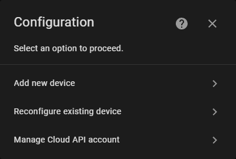
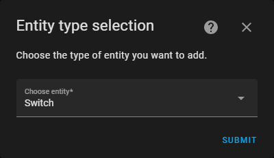
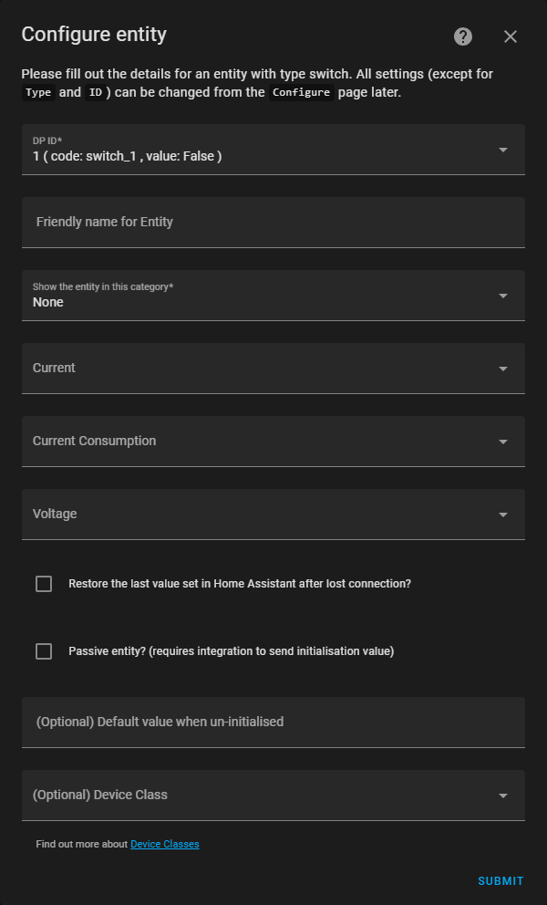
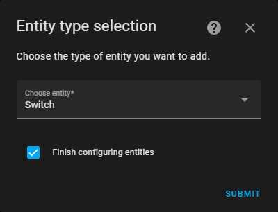

# Add new devices    

!!! Note "Before You Start"
    You must have your device's `localkey` and `ID` to add your device to **LocalTuya**. The easiest way is to configure the Cloud API account in the integration.

    If you want to obtain the `id and localkey` without configuring the cloud API, good guides are available for <br>
    [TuyaAPI Setup](https://github.com/codetheweb/tuyapi/blob/master/docs/SETUP.md){target=_blank}, 
    [TinyTuya](https://pypi.org/project/tinytuya/.){target=_blank}, 
    or [MarkVideo](https://www.youtube.com/watch?v=YKvGYXw-_cE){target=_blank}.

    !!! danger "Important"
        Before adding any device, ensure that `Smart Life` and `Tuya Smart` apps are closed on your phones. Devices shouldn't be added to different local integrations as __some__ Tuya devices can only accept one local connection at a time.

After setting up the integration, you can now manage your devices by `adding` or `editing`<br>
Go to hub `Configure` (1) a menu will show up (2) Choose `Add new device`
{ .annotate }

1. 
2. "The `Reconfigure existing device` option will appear if there are devices that have already been set up."<br><br> 


!!! Note "Discovery"
    By default, `LocalTuya` includes a discovery feature that scans for Tuya devices within the local network, listing them in the config flow. However, this function requires the Home Assistant machine to be connected to the same network as the Tuya devices and might not function across different subnets,

1. Selecting `Add new device` will display a new page with the listed discovered devices (1) <br> Select the device you wish to configure, then click on `Submit`.
    {.annotate}

    1. If the device is configured on a Tuya account, the ID will be replaced with the name. If not, it will remain as `... (IP)` <br><br> 

2. `Configure device`: Fill in the fields that are still missing and are `required`<br>

    ??? info "Device Name"
        A name for the device, for example, _`Bedroom 2G`_ Following this, entities ID will be associated with the device name. 
        e.g. an entity named `switch 1` will have an `entity id`  `switch.bedroom_2g_switch_1`.

    ??? info "IP"
        The device's IP Address e.g., `192.168.1.55`. <br>`This is automatically inserted if you choose a discovered device`

    ??? info "Device ID"
        The device ID See [top note](#top).<br>`Automatically inserted if you choose a discovered device`

    ??? info "Local Key"
        The localkey for the device. See [top note](#top) <br>`Automatically inserted if the cloud API is configured and the device is added to the account`

    ??? info "(optional) Enable Debug"
        Device will send `Debug messages` in logs. `Use it if you have issues and want to track them` <br>
        You need to enable logger debug in `configuration.yaml` for localtuya. <br>
        ```yaml
        logger:
          logs:
            custom_components.localtuya: debug
            custom_components.localtuya.pytuya: debug
        ```

    ??? info "(optional) Scan Interval"
        Only needed if energy/power values are not updating frequently enough by default. <br>Values less than 10 seconds may cause stability issues

    ??? info "(Optional) Manual DPS"
        Needed if the device doesn't advertise the DPS correctly until the entity has been properly initialized. This setting can often be avoided by first connecting/initializing the device with the Tuya App, then closing the app, and then adding the device to the integration. <br>Note: Any DPS added using this option will have a `-1` value during setup e.g. `20,21,22`

    ??? info "(Optional) DPIDs Reset"
        Used when a device doesn't respond to any Tuya commands after a power cycle, but can be connected to (zombie state). This scenario mostly occurs when the device is blocked from accessing the internet. The DPids will vary between devices, but typically "18,19,20" is used. If the wrong entries are added here, then the device may not come out of the zombie state. Typically only sensor DPIDs entered here.

    ??? info "(Optional) Node ID or CID"
        `Node ID` also known as `CID` only for sub devices that work through `Gateways` e.g. `ZigBee` and `BLE` Devices. 

3. After a successful connection, it's time to set up the entities.

### Configure device methods
!!! Abstract "How does localtuya work"
    Before setting up device entities, let me explain how `LocalTuya` control devices: Tuya devices have different functions such as Switch 1, Switch 2, and more, each identified by a DP ID. `LocalTuya` configures entities by using and managing the function values using their respective DP IDs.<br>
    _LocalTuya will pull these functions for you to set them up as Home Assistant entities_

#### Discover device entities automatically 
!!! quote ""
    Automatic setup is only supported for CloudAPI setup.<br>
    Note: It's possible to tweak the entities config later after auto configure.

<br>

#### Configure device entities manually
!!! note ""
    Below, I used `2 Gang Tuya Switch` as an example
This option will work for everyone, but it's more advanced.

1. Selecting the manual setup option will bring up a new page listing supported platforms `platforms` (1)
Each platform has its unique configuration page with different sets of configuration fields. <br> <br>
{.annotate}

    1. 

2. Configure `switch platform` (1)
{.annotate}

    1. 

    !!! tip annotate "`DP` fields (1)"
        The DP fields will display all the DP IDs reported by the device along with their respective values (3)<br><br>
        Taking `1 (code: switch_1, value: False)` as an example<br>
        DP `1` refers to `1st gang on my switch`, it's `off` due to its value being _False_ (2)<br><br>

        ??? note "Multi `DP` Fields"
            Some platform configurations consist of multiple DP fields. For example, in the `climate`<br>
            there are DPs to toggling on and off, as well as for setting the temperature and change mode 

        <!-- ??? note "`DP` Cloud pull"
            Sometimes Devices don't report the all `DPS`, However `localtuya` will pull them if cloud is setup.<br>
            it's only recommended to use this `DPs` for button platform -->

    1. 
    2. `DP 1` Switch 1 is `OFF` `[1st gang]` <br> `DP 2` Switch 2 is `OFF` `[2nd gang]` <br> `DP 7` Switch 1 Timer is `0` <br> `DP 8` Switch 2 Timer is `0` <br> <br> 
    3. `Code only shows if cloud setup`

    Most DP fields are optional, but the __ID__ is always required. For example, select the Switch platform and set the ID to 1. 
    This will configure a switch entity that controls the `first Gang switch`<br> <br>

3. When submitting the first entity, if there are additional unconfigured DP IDs, it will prompt you to either complete the process or add more entities (1)
    {.annotate}
    
    1. 

    !!! info ""
        I unchecked `Finish configuring entities` and repeated `step 2` to add another `switch` entity that controls `ID 2` <- `2nd Gang switch` 

4. After completing the addition of entities, check `Finish configuring entities` and submit to add your device and entities
<br>

#### Use saved template
!!! info "Templates"
    You can import a ready-to-go device configuration through the 'add device' process. This feature is useful for creating backups, sharing configurations, 
    or setting up similar devices. All templates stored in the 'templates' directory will be listed in the 'Use saved template' step.<br>
    __Templates directory located in `custom_components/localtuya/templates`__.
    !!! annotate note ""
        Templates are loaded when Home Assistant (HA) starts, so for them to appear in the list, a restart is required.<br>
        __However__, When importing a template, you can manually enter the name, such as `my_template.yaml` (1)<br>
    1. This will load the template even if it didn't appear in the list<br> <br> 

##### Create templates
There are two ways to create templates

1. Export a configured device from the [Reconfigure existing device](configure_edit_device.md) step
2. Manually write the configuration __`YAML`__ file `Not Recommended`

??? example "`Cover` template example"
    ```yaml
    - cover:
        commands_set: open_close_stop
        current_position_dp: '3'
        entity_category: None
        friendly_name: My BedRoom Shade
        id: '1'
        platform: cover
        position_inverted: false
        positioning_mode: position
        set_position_dp: '2'
        span_time: 25.0
    - select:
        entity_category: config
        friendly_name: My BedRoom Shade Motor Direction
        id: '5'
        is_passive_entity: false
        platform: select
        restore_on_reconnect: false
        select_options: forward;back
        select_options_friendly: Forward;Reverse
    - select:
        entity_category: config
        friendly_name: My BedRoom Shade Motor Mode
        id: '106'
        is_passive_entity: false
        platform: select
        restore_on_reconnect: false
        select_options: contiuation;point
        select_options_friendly: Auto;Manual
    - binary_sensor:
        device_class: problem
        entity_category: diagnostic
        friendly_name: My BedRoom Shade Fault
        id: '12'
        platform: binary_sensor
        state_off: '0'
        state_on: '1'
    ```

